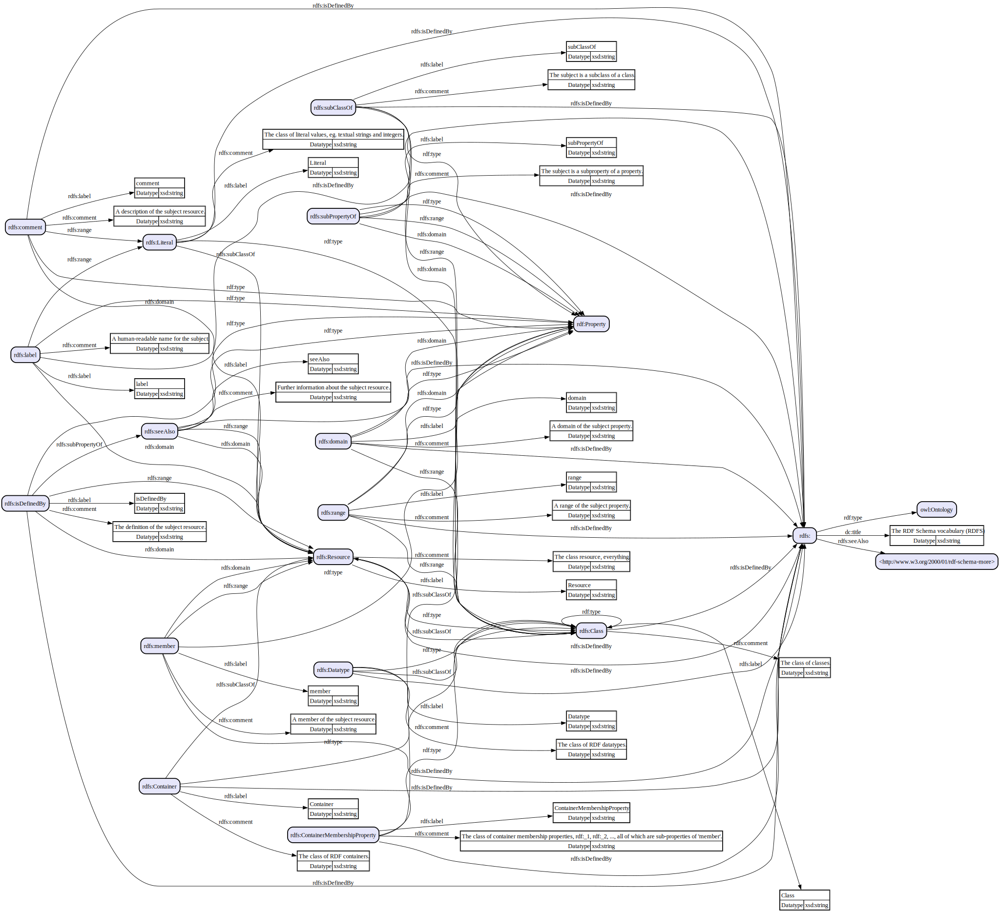

# rdfkit-go

Work with RDF-related concepts, datasets, and files in Go.
 
* Decode TriG, N-Quads, XML, JSON-LD, HTML, and other RDF-based sources.
* Reference common IRI constants generated from vocabularies.
* Canonicalize datasets with RDFC-1.0.
* Track data lineage for RDF properties within source files.
* Build higher-level abstractions based on RDF primitives.

## Usage

Import the module and refer to the code's documentation ([pkg.go.dev](https://pkg.go.dev/github.com/dpb587/rdfkit-go)).

```go
import "github.com/dpb587/rdfkit-go/rdf"
```

Some sample use cases and starter snippets can be found in the [`examples` directory](examples).

<details><summary><code>examples$ go run <strong>./rdf-to-dot -i https://www.w3.org/2000/01/rdf-schema.ttl</strong> | dot -Tsvg</code></summary>



</details>

<details><summary><code>examples$ go run <strong>./html-extract https://microsoft.com</strong></code></summary>

```turtle
@base <https://www.microsoft.com/en-us/> .
@prefix og: <http://ogp.me/ns#> .
@prefix schema: <http://schema.org/> .

</>
	a schema:WebSite ;
	schema:potentialAction [
		a schema:SearchAction ;
		schema:query\-input "required name=search_term_string" ;
		schema:target [
			a schema:EntryPoint ;
			schema:urlTemplate "https://www.microsoft.com/en-us/search/explore?q={search_term_string}&ocid=AID_seo_sitelinks_search"
		]
	] ;
	schema:url </> .
<>
	og:description "Explore Microsoft products and services and support for your home or business. Shop Microsoft 365, Copilot, Teams, Xbox, Windows, Azure, Surface and more."@en-US ;
	og:title "Microsoft – AI, Cloud, Productivity, Computing, Gaming & Apps"@en-US ;
	og:type "website"@en-US ;
	og:url "https://www.microsoft.com/en-us"@en-US .
_:b0
	a schema:Organization ;
	schema:logo <https://uhf.microsoft.com/images/microsoft/RE1Mu3b.png> ;
	schema:name "Microsoft" ;
	schema:url <https://www.microsoft.com> .
```

</details>

## Primitives

Based on the [Resource Description Framework](https://www.w3.org/TR/rdf11-concepts/) (RDF), there are three primitive value types, aka *terms*, that are used to represent data: *IRIs*, *literals*, and *blank nodes*. The primitive value types are the basis of *triples* and other assertions about information.

### IRI

An *IRI* records a URL-based identity as a `string` value.

```go
resourceIRI := rdf.IRI("http://example.com/resource")
```

Some well-known IRIs are defined in subpackages such as `rdfiri` and `xsdiri` - see [Ontologies](#ontologies) for more details. The [`iriutil` package](rdf/iriutil) provides additional support for mapping IRIs from prefixes and CURIEs.

### Literal

A *literal* records more traditional data values, such as booleans and strings. It *must* include both a datatype (IRI) and its string-encoded data. The lexical form should always follow the datatype-specific recommendations for valid data.

```go
trueLiteral := rdf.Literal{
  Datatype:    xsdiri.Boolean_Datatype,
  LexicalForm: "true",
}
```

A `Tag` field is supported for limited datatypes, namely `rdf:langString`, where additional properties are required for the literal.

```go
helloWorldLiteral := rdf.Literal{
  Datatype:    rdfiri.LangString_Datatype,
  LexicalForm: "Hello World",
  Tag: rdf.LanguageLiteralTag{
    Language: "en",
  },
}
```

Literals can be tedious to work with, so some well-known data types have Go primitives and utility functions - see [Ontologies](#ontologies) for more details.

```go
helloWorldLiteral == rdfobject.NewLangString("en", "Hello World")
```

### Blank Node

A *blank node* represents an anonymous resource and are always created with a unique, internal identifier. Two blank nodes are equivalent if and only if they have the same identifier.

```go
bnode := rdf.NewBlankNode()
```

The [`blanknodeutil` package](rdf/blanknodeutil) provides additional support for using string-based identifiers (e.g. `b0`), mapping blank nodes from implementations, and scoped factories.

### Triple

A *triple* is used to describe some sort of statement about the world. Within the triple, a *subject* is said to have some relationship, the *predicate*, with an *object*.

```go
nameTriple := rdf.Triple{
  Subject:   rdf.NewBlankNode("b0"),
  Predicate: schemairi.Name_Property,
  Object:    helloWorldLiteral,
}
```

The fields of a triple are restricted to the normative value types they support, described by the table below.

| Field | IRI | Literal | Blank Node |
| ----- |:---:|:-------:|:----------:|
| Subject | Valid | Invalid | Valid |
| Predicate | Valid | Invalid | Invalid |
| Object | Valid | Valid | Valid |

The `rdf` package includes other supporting types (e.g. `TripleList`, `TripleIterator`, and `TripleMatcher`), and the [`triples` package](rdf/triples) offers additional interfaces and utilities for working with triple types.

### Quad

A *quad* is used to describe a triple with an optional graph name. A graph name may be an IRI, Blank Node, or `nil` which indicates the default graph.

```go
nameQuad := rdf.Quad{
  Triple:    nameTriple,
  GraphName: rdf.IRI("http://example.com/graph"),
}
```

Similar to triples, the `rdf` and [`quads` package](rdf/quads) offers additional interfaces and utilities.

## Graphs

A *graph* is a set of triples, all of which collectively describe the state of a world. The `triples.Graph*` interfaces describe basic operations, such as adding or iterating triples.

```go
err := graph.AddTriple(ctx, nameTriple)
iter, err := graph.NewTripleIterator(ctx)
```

### Datasets

A *dataset* is a set of graphs (is a set of triples). The `quads.Dataset*` interfaces describe basic operations, such as adding or iterating quads.

```go
err := dataset.AddQuad(ctx, nameQuad)
iter, err := dataset.NewQuadIterator(ctx)
```

The usage of a dataset vs graph vs dataset graphs is very application-specific. For broader discussion on the semantics and logical considerations of datasets, review [this W3C Note](https://www.w3.org/TR/2014/NOTE-rdf11-datasets-20140225/).

### Implementations

The [`inmemory` experimental package](x/storage/inmemory) offers a dataset implementation which may be useful for small collections and labeled property graph features.

```go
storage := inmemory.NewDataset()
```

Better-supported storage or alternative, remote service clients will likely be a focus on the future.

## Encodings

An *encoding* (or *file format*) is used to decode and encode RDF data. The following encodings are available under the [`encoding` package](encoding).

| Package | Decode | Encode |
|:------- |:------:|:------:|
| [`htmljsonld`](encoding/htmljsonld) | Quad | n/a |
| [`htmlmicrodata`](encoding/htmlmicrodata) | Triple | n/a |
| [`jsonld`](encoding/jsonld) | Quad | Quad |
| [`nquads`](encoding/nquads) | Quad | Quad |
| [`ntriples`](encoding/ntriples) | Triple | Triple |
| [`rdfa`](encoding/rdfa) | Triple | n/a |
| [`rdfjson`](encoding/rdfjson) | Triple | Triple |
| [`rdfxml`](encoding/rdfxml) | Triple | n/a |
| [`trig`](encoding/trig) | Quad | n/a |
| [`turtle`](encoding/turtle) | Triple | Triple, Description |

Some encodings do not yet support all syntactic features defined by their official specification, though they should cover common practices. Most are tested against some sort of test suite (such as the ones published by W3C), and the latest results can be found in their `testsuites/*/testresults` directory.

Broader support for encoders will likely be added in the future.

### Decoder

Encodings provide a `NewDecoder` function which require an `io.Reader` and optional `DecoderConfig` options. It can be used as an iterator for all statements found in the encoding. Depending on the capabilities of the encoding format, the decoder fulfills either the `encoding.TripleDecoder` or `encoding.QuadDecoder` interface.

```go
decoder := nquads.NewDecoder(os.Stdin)
defer decoder.Close()

for decoder.Next() {
  quad := statement.Quad()

  fmt.Fprintf(os.Stdout, "%v\t%v\t%v\t%v\n", quad.Triple.Subject, quad.Triple.Predicate, quad.Triple.Object, quad.GraphName)
}

err := decoder.Err()
```

Most are stream processors, so valid statements may be produced before a syntax error is encountered. When a syntax error occurs, the byte offset (and text offset, when enabled) of the occurrence is included.

#### Text Offsets

Most decoders can capture the exact byte and line+column offsets where a statement's subject, predicate, object, and graph name was decoded from the source. The `encoding.StatementTextOffsetsProvider` interface supports accessing a `StatementTextOffsets` map of property-offsets. To enable capturing this metadata, use the decoder's `CaptureTextOffsets` option.

```go
for decoder.Next() {
  for propertyType, propertyOffsets := range decoder.StatementTextOffsets() {
    fmt.Fprintf(
      os.Stderr,
      "> found %s from L%dC%d (byte %d) until %s (byte %d)\n",
      encoding.StatementOffsetsTypeName(propertyType),
      propertyOffsets.From.LineColumn[0],
      propertyOffsets.From.LineColumn[1],
      propertyOffsets.From.Byte,
      // same as L%dC%d
      propertyOffsets.Until.LineColumn.TextOffsetRangeString(),
      propertyOffsets.Until.Byte,
    )
  }
}
```

When working with offsets, consider the following caveats.

* Capturing and processing text offsets comes with a slight impact to performance and memory.
* Offsets for some properties may not always be available due to decoding limitations.
* Offsets for some properties may be "incomplete" due to stream processing. For example, `turtle` may only refer to the opening `[` token of an anonymous resource when the closing `]` token has not yet been read.

### Encoder

A few encodings similarly provide a `NewEncoder` requiring an `io.Writer` and `EncoderConfig` options. At a minimum, encoders fulfill the `encoding.TripleEncoder` or `encoding.QuadEncoder` interfaces.

```go
encoder := nquads.NewWriter(os.Stdout)
defer encoder.Close()

for _, quad := range quadList {
  err := encoder.AddQuad(ctx, quad)
}
```

When encoding data, the `Close` method *must* be called before the data can be successfully decoded.

## Resource Descriptions

The [`rdfdescription` package](rdfdescription) offers an alternative method for describing nested resources and statements.

```go
resource := rdfdescription.SubjectResource{
  Subject: rdf.IRI("http://example.com/product"),
  Statements: rdfdescription.StatementList{
    rdfdescription.ObjectStatement{
      Predicate: rdfiri.Type_Property,
      Object:    schemairi.Product_Thing,
    },
    rdfdescription.AnonResourceStatement{
      Predicate: schemairi.Offer_Property,
      AnonResource: rdfdescription.AnonResource{
        Statements: rdfdescription.StatementList{
          rdfdescription.ObjectStatement{
            Predicate: rdfiri.Type_Property,
            Object:    schemairi.Offer_Thing,
          },
          rdfdescription.ObjectStatement{
            Predicate: schemairi.Price_Property,
            Object:    schemaobject.Number(55),
          },
          rdfdescription.ObjectStatement{
            Predicate: schemairi.PriceCurrency_Property,
            Object:    schemaobject.Text("USD"),
          },
        },
      },
    },
  },
}
```

A description can be converted to triples by calling its `NewTriples` function. Each invocation creates new blank nodes for anonymous resources, so the triples returned from separate invocations may be non-isomorphic.

```go
resourceTriples := resource.NewTriples()
```

### Encoding Support

Some encodings support a syntax for structured statements (e.g. JSON-LD, Turtle) and implement the `rdfdescriptionutil.Encoder` or `rdfdescriptionutil.DatasetEncoder` interface.

```go
err := turtleEncoder.AddResource(ctx, resource)
```

### Resource List Builder

The `ResourceListBuilder` may be used to construct resources from their triples. Once constructed, they can be enumerated with `GetResources()` or sent directly to supported encoders.

```go
builder := rdfdescription.NewResourceListBuilder()
// builder.Add(rdf.Triple{...}, ...)
err := builder.AddTo(ctx, turtleEncoder, true)
```

## Canonicalization

The [`rdfcanon` package](rdfcanon) implements the RDFC-1.0 algorithm based on [RDF Dataset Canonicalization](https://www.w3.org/TR/rdf-canon/).

```go
canonicalized, err := rdfcanon.Canonicalize(quadIterator)
```

Once canonicalized, the encoded N-Quads form can be directly written to an `io.Writer`.

```go
_, err := canonicalized.WriteTo(os.Stdout)
```

Alternatively, use `NewIterator` to manually iterate over the results containing its encoded form. If the `BuildCanonicalQuad` option was enabled, use `NewQuadIterator` for a standard `rdf.QuadIterator` of quads including the canonicalized blank nodes.

```go
canonicalized, err := rdfcanon.Canonicalize(quadIterator, rdfcanon.CanonicalizeConfig{}.
  SetBuildCanonicalQuad(true),
)
iter := canonicalized.NewQuadIterator()
```

## Ontologies

An *ontology* (or *vocabulary*) offers domain-specific conventions for working with data. Several well-known ontologies are within the [`ontology` package](./ontology) and offer IRI constants, helpers for literals, and other data utilities.

* earl - [`earliri`](ontology/earl/earliri), [`earltesting`](ontology/earl/earltesting)
* foaf - [`foafiri`](ontology/foaf/foafiri)
* owl - [`owliri`](ontology/owl/owliri)
* rdf - [`rdfiri`](ontology/rdf/rdfiri), [`rdfliteral`](ontology/rdf/rdfliteral), and [`rdfvalue`](ontology/rdf/rdfvalue)
* rdfa - [`rdfairi`](ontology/rdfa/rdfairi)
* rdfs - [`rdfsiri`](ontology/rdfs/rdfsiri)
* schema - [`schemairi`](ontology/schema/schemairi), [`schemaobject`](ontology/schema/schemaobject), and other utilities
* xsd - [`xsdiri`](ontology/xsd/xsdiri), [`xsdobject`](ontology/xsd/xsdobject), [`xsdtype`](ontology/xsd/xsdtype), and other utilities

To help maintain consistency, the following practices are used for the naming and implementations.

* The `{prefix}` should be based on [RDFa Core Initial Context](https://www.w3.org/2011/rdfa-context/rdfa-1.1), [vann:preferredNamespacePrefix](https://vocab.org/vann/#preferredNamespacePrefix), or similarly-defined term.
* `{prefix}iri` package - constants for resource IRIs defined in the vocabulary. The `irigen` command can be used for most of these.
  * `const Base rdf.IRI` - the preferred base IRI. For example, `http://www.w3.org/1999/02/22-rdf-syntax-ns#`.
  * `const {Name}_{Type} rdf.IRI` - For example, the statement `rdf:type a rdf:Property` becomes the constant `rdfiri.Type_Property` with a value of `Base + "type"`. If a resource is defined with multiple types, the first type listed in the vocabulary should be used.
* `{prefix}object` package - convenience functions wrapping `{prefix}type` for `rdf.ObjectValue`-related types.
  * `func {Datatype}(...) rdf.ObjectValue` - factory-style functions for returning a canonical `rdf.ObjectValue` value.
  * `func Map{Datatype}(lexicalForm string) (rdf.ObjectValue, error)` - for mapping a lexical form into a canonical `rdf.ObjectValue` value.
* `{prefix}type` package - Go-native types and utilities for working with defined datatypes.
  * `type {Datatype} {any}` - a Go-native type representing canonical value forms, satisfying the `objecttypes.Value` interface.
  * `func Map{Datatype}(lexicalForm string) ({Datatype}, error)` - for mapping a lexical form into its Go-native type.

### Literal Mapping

Mapping functions can decode the lexical form to return a Go-native type which represents the datatype (or error due to invalid input).

```go
trueValue, err := xsdvalue.MapBoolean(trueLiteral.LexicalForm)
trueValue == xsdvalue.Boolean(true)
bool(trueValue) == true
trueValue.AsLiteralTerm() == trueLiteral
```

## IRIs

### Prefixes

A common practice with IRIs is defining prefixes that may be used to expand and compact IRIs. These prefixes are often used in encoding formats.

```go
prefixes := iriutil.NewPrefixMap(
  iriutil.PrefixMapping{
    Prefix: "ex",
    Expanded: "http://example.com/",
  },
)

rIRI, ok := prefixes.ExpandPrefix("ex", "resource")
ok && rIRI == rdf.IRI("http://example.com/resource")

_, ok = prefixes.ExpandPrefix("unknown", "resource")
!ok

rNS, rLocalName, ok := prefixes.CompactPrefix(rdf.IRI("http://example.com/resource"))
ok && rNS == "http://example.com/" && rLocalName == "resource"

_, _, ok = prefixes.CompactPrefix(rdf.IRI("https://example.com/secure"))
!ok
```

### CURIE Syntax

The [`curie` package](rdf/iriutil/curie/) provides several functions for working with CURIE syntax based on [CURIE Syntax](https://www.w3.org/TR/curie/).

```go
rCURIE, ok := curie.Parse("[ex:resource]")
ok && rCURIE.Safe && rCURIE.Prefix == "ex" && rCURIE.Reference == "resource"

mappings := curie.MappingScope{
  Prefixes: prefixes,
}

rIRI, ok := mappings.ExpandCURIE(parsed)
ok && rIRI == "http://example.com/resource"
```

### RDFa Core Initial Context

The [`rdfacontext` package](rdf/iriutil/rdfacontext/) provides a list of prefix mappings defined by the W3C at [RDFa Core Initial Context](https://www.w3.org/2011/rdfa-context/rdfa-1.1). This includes prefixes such as `owl:`, `rdfa:`, and `xsd:`. The list of widely-used prefixes is included as well, which includes prefixes such as `dc:` and `schema:`.

## Command Line

The `cmd/rdfkit` package offers a command line interface with a few utilities. Most notably:

* `irigen` - generate Go constants from an RDF vocabulary. Used internally for most of the `*iri` packages.
* `pipe` - decode local files or remote URLs, and then re-encode using any of the supported RDF formats.

## Notes

* **RDF 1.2** (i.e. RDF-star) - not currently supported; waiting for more stability in the draft specification and definitions.
* **Generalized RDF** - not currently supported; may be introduced in the future as a breaking change or via build tag.
* This is a periodically updated fork based on private usage. There may still be some breaking changes before starting to version this module.

## License

[MIT License](LICENSE)
