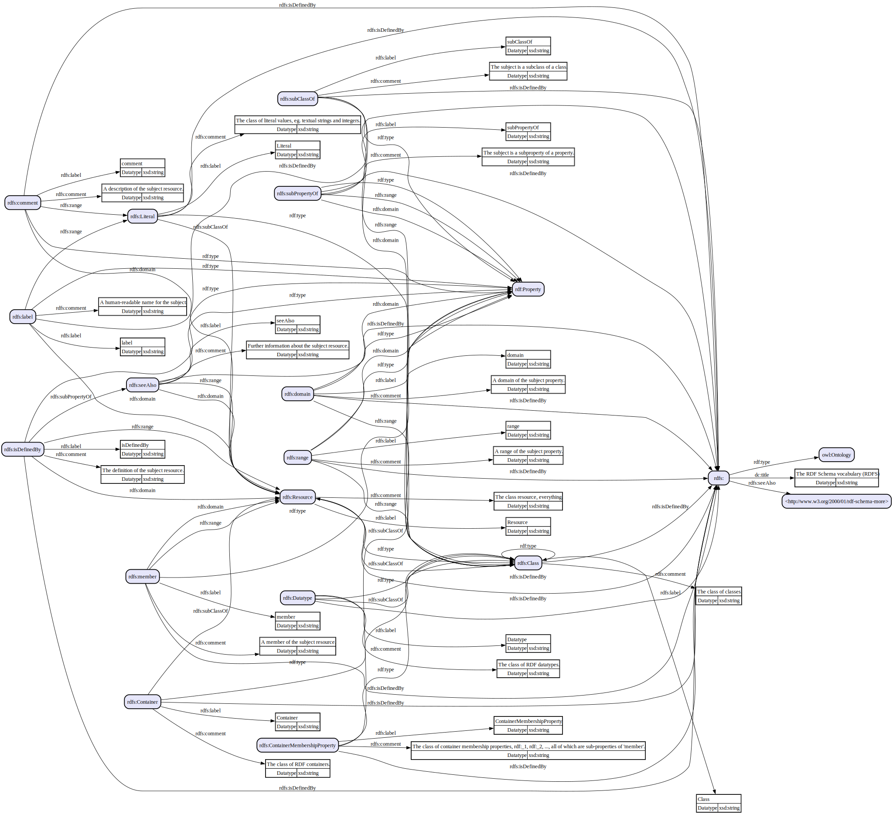

# rdfkit-go

Work with RDF-related concepts, datasets, and files in Go.
 
* Decode TriG, N-Quads, XML, JSON-LD, HTML, and other RDF-based sources.
* Reference IRI constants generated from vocabulary definitions.
* Track data lineage for RDF properties within source files.
* Build higher-level abstractions based on RDF primitives.

## Usage

Import the module and refer to the code's documentation ([pkg.go.dev](https://pkg.go.dev/github.com/dpb587/rdfkit-go)).

```go
import "github.com/dpb587/rdfkit-go/rdf"
```

Some sample use cases and starter snippets can be found in the [`examples` directory](examples).

<details><summary><code>examples$ go run <strong>./rdf-to-dot -i https://www.w3.org/2000/01/rdf-schema.ttl</strong> | dot -Tsvg</code></summary>



</details>

<details><summary><code>examples$ go run <strong>./html-extract https://microsoft.com</strong></code></summary>

```turtle
@base <https://www.microsoft.com/en-us/> .
@prefix og: <http://ogp.me/ns#> .
@prefix schema: <http://schema.org/> .

</>
	a schema:WebSite ;
	schema:potentialAction [
		a schema:SearchAction ;
		schema:query\-input "required name=search_term_string" ;
		schema:target [
			a schema:EntryPoint ;
			schema:urlTemplate "https://www.microsoft.com/en-us/search/explore?q={search_term_string}&ocid=AID_seo_sitelinks_search"
		]
	] ;
	schema:url </> .
<>
	<SHORTCUT> </favicon.ico?v2> ;
	<canonical>
		</en-us> ,
		</en-us> ;
	og:description "Explore Microsoft products and services and support for your home or business. Shop Microsoft 365, Copilot, Teams, Xbox, Windows, Azure, Surface and more."@en-US ;
	og:title "Microsoft – AI, Cloud, Productivity, Computing, Gaming & Apps"@en-US ;
	og:type "website"@en-US ;
	og:url "https://www.microsoft.com/en-us"@en-US .
_:b0
	a schema:Organization ;
	<logo> <https://uhf.microsoft.com/images/microsoft/RE1Mu3b.png> ;
	<name> "Microsoft" ;
	<url> <https://www.microsoft.com> .

```

</details>

## Primitives

Based on the [Resource Description Framework](https://www.w3.org/TR/rdf11-concepts/) (RDF), there are three primitive value types, aka *terms*, that are used to represent data: *IRIs*, *literals*, and *blank nodes*. The primitive value types are the basis of *triples* and other assertions about information.

### IRI

An *IRI* records a URL-based identity as a `string` value.

```go
resourceIRI := rdf.IRI("http://example.com/resource")
```

The [`iriutil` package](rdf/iriutil) provides additional support for mapping IRIs from prefixes and CURIEs. Some well-known IRIs are defined in subpackages such as `rdfiri` and `xsdiri` - see [Ontologies](#ontologies) for more details.

### Literal

A *literal* records more traditional data values, such as booleans and strings. It *must* include both a datatype (IRI) and its string-encoded, lexical form. The lexical form should always follow the datatype-specific recommendations for what a valid form looks like.

```go
trueLiteral := rdf.Literal{
  Datatype:    xsdiri.Boolean_Datatype,
  LexicalForm: "true",
}
```

Literals can be tedious to work with, so some well-known data types have factory-style functions. See [Ontologies](#ontologies) for utilities and other methods using Go primitives.

### Blank Node

A *blank node* represents an anonymous resource and are always created with a unique, internal identifier. Two blank nodes are equivalent if and only if they have the same identifier.

```go
bnode := rdf.NewBlankNode()
```

The [`blanknodeutil` package](rdf/blanknodeutil) provides additional support for using string-based identifiers (e.g. `b0`), mapping blank nodes from implementations, and scoped factories.

### Triple

A *triple* is used to describe some sort of statement about the world. Within the triple, a *subject* is said to have some relationship, the *predicate*, with an *object*.

```go
nameTriple := rdf.Triple{
  Subject:   rdf.NewBlankNode("b0"),
  Predicate: schemairi.Name_Property,
  Object:    xsdliteral.NewString("Web Vocab"),
}
```

The fields of a triple are restricted to the normative value types they support, described by the table below. Using a triple as a triple term is not yet supported.

| Field | IRI | Literal | Blank Node |
| ----- |:---:|:-------:|:----------:|
| Subject | Valid | Invalid | Valid |
| Predicate | Valid | Invalid | Invalid |
| Object | Valid | Valid | Valid |

## Graphs

A *graph* is a set of triples, all of which collectively describe the state of a world. An `rdfio.Graph*` interface supports basic operations, such as working with triples.

```go
err := storage.PutTriple(ctx, nameTriple)
```

### Datasets

A *dataset* is a set of graphs (is a set of triples). By convention, when a graph-agnostic function is invoked, such as `PutTriple`, it will be executed against the default graph if the underlying storage is a dataset. The following is equivalent to the previous example, assuming `storage` is a dataset.

```go
err := storage.PutGraphTriple(ctx, rdf.DefaultGraph, nameTriple)
```

The usage of a dataset vs graph vs dataset graphs is very application-specific. Within Go, interfaces are defined for datasets and graphs, but can be used interchangeably for some use cases. For broader discussion on the semantics and logical considerations of datasets, review [this W3C Note](https://www.w3.org/TR/2014/NOTE-rdf11-datasets-20140225/).

### Statements

A *statement* is the representation of a triple within a graph, and it is described by the `rdfio.Statement` interface.

```go
iter := storage.NewStatementIterator(ctx)

defer iter.Close()

for iter.Next() {
  statement := iter.GetStatement()
  statementTriple := statement.GetTriple()

  fmt.Fprintf(os.Stderr, "%v\t%v\t%v\n", statementTriple.Subject, statementTriple.Predicate, statementTriple.Object)
}

if err := iter.Err(); err != nil {
  panic(err)
}
```

As an interface, storage implementations may offer additional capabilities for statements.

### Nodes

A *node* is the representation of a resource (i.e. blank node or IRI) within a graph. Similar to statements, implementations of the `rdfio.Node` interface may offer additional capabilities.

```go
iter := storage.NewNodeIterator(ctx)

for iter.Next() {
  node := iter.GetNode()

  fmt.Fprintf(os.Stderr, "%v\n", node.GetTerm())
}

if err := iter.Err(); err != nil {
  panic(err)
}
```

### Storage

The [`inmemory` experimental package](x/storage/inmemory) currently offers a single, in-memory dataset which may be useful for small collections and labeled property graph conventions.

```go
storage := inmemory.NewDataset()
```

Better-supported storage or alternative, remote service clients will likely be a focus on the future.

## Encodings

An *encoding* (or *file format*) is used to decode and encode RDF data. The following encodings are available under the `encoding` package.

| Package | Decode | Encode |
|:------- |:------:|:------:|
| [`htmljsonld`](encoding/htmljsonld) | Dataset | n/a |
| [`htmlmicrodata`](encoding/htmlmicrodata) | Graph | n/a |
| [`jsonld`](encoding/jsonld) | Dataset | Triple, Description |
| [`nquads`](encoding/nquads) | Dataset | Triple, Quad |
| [`ntriples`](encoding/ntriples) | Graph | Triple |
| [`rdfa`](encoding/rdfa) | Graph | n/a |
| [`rdfjson`](encoding/rdfjson) | Graph | Triple |
| [`rdfxml`](encoding/rdfxml) | Graph | n/a |
| [`trig`](encoding/trig) | Dataset | n/a |
| [`turtle`](encoding/turtle) | Graph | Triple, Description |

Some encodings do not yet support all syntactic features defined by their official specification, though they should cover common practices. Most are tested against some sort of test suite (such as the ones published by W3C), and the latest results can be found in their `testsuites/*/RESULTS.md` files.

Broader support for encoders will likely be added in the future.

### Decoder

Encodings provide a `NewDecoder` function which require an `io.Reader` and optional `DecoderConfig` options. It can be used as an iterator for all statements found in the encoding. Depending on the capabilities of the encoding format, the decoder fulfills either the `encoding.DatasetDecoder` or `encoding.GraphDecoder` interface.

```go
decoder := nquads.NewDecoder(os.Stdin)
defer decoder.Close()

for decoder.Next() {
  statement := decoder.GetStatement()
  triple := statement.GetTriple()

  fmt.Fprintf(os.Stdout, "[%v] %v\t%v\t%v\n", statement.GetGraphName(), triple.Subject, triple.Predicate, triple.Object)
}

err := decoder.Err()
```

Most are stream processors, so valid statements may be produced before a syntax error is encountered. When a syntax error occurs, the byte offset (and text offset, when enabled) of the occurrence is included.

#### Text Offsets

Most decoders can capture the exact byte and line+column offsets where a statement's graph name, subject, predicate, and object value was decoded from the source. To include this metadata in the decoded statements, enable `CaptureTextOffsets` via the decoder's options. A map of property-offsets can be accessed through the `encoding.TextOffsetsStatement` interface.

```go
for propertyType, propertyOffsets := range statement.(encoding.TextOffsetsStatement).GetStatementTextOffsets() {
  fmt.Fprintf(
    os.Stderr,
    "> found %s from L%dC%d (byte %d) until %s (byte %d)\n",
    encoding.StatementOffsetsTypeName(propertyType),
    propertyOffsets.From.LineColumn[0],
    propertyOffsets.From.LineColumn[1],
    propertyOffsets.From.Byte,
    // same as L%dC%d
    propertyOffsets.Until.LineColumn.TextOffsetRangeString(),
    propertyOffsets.Until.Byte,
  )
}
```

When working with offsets, consider the following caveats.

* Capturing and processing text offsets comes with a slight impact to performance and memory.
* Offsets for some properties may not always be available due to decoding limitations.
* Offsets for some properties may be "incomplete" due to stream processing. For example, `turtle` may only refer to the opening `[` token of an anonymous resource when the closing `]` token has not yet been read.

### Encoder

A few encodings similarly provide a `NewEncoder` requiring an `io.Writer` and `EncoderConfig` options.

```go
encoder := nquads.NewWriter(os.Stdout)
defer encoder.Close()

for _, triple := range tripleList {
  err := encoder.PutGraphTriple(ctx, rdf.DefaultGraph, triple)
}
```

## Resource Descriptions

The [`rdfdescription` package](rdfdescription) offers an alternative method for describing a resource with statements.

```go
resource := rdfdescription.SubjectResource{
  Subject: rdf.IRI("http://example.com/product"),
  Statements: rdfdescription.StatementList{
    rdfdescription.ObjectStatement{
      Predicate: rdfiri.Type_Property,
      Object:    schemairi.Product_Thing,
    },
    rdfdescription.AnonResourceStatement{
      Predicate: schemairi.Offer_Property,
      AnonResource: rdfdescription.AnonResource{
        Statements: rdfdescription.StatementList{
          rdfdescription.ObjectStatement{
            Predicate: rdfiri.Type_Property,
            Object:    schemairi.Offer_Thing,
          },
          rdfdescription.ObjectStatement{
            Predicate: schemairi.Price_Property,
            Object:    schemaliteral.NewNumber(55.00),
          },
          rdfdescription.ObjectStatement{
            Predicate: schemairi.PriceCurrency_Property,
            Object:    schemaliteral.NewText("USD"),
          },
        },
      },
    },
  },
}
```

A description can be converted to triples by calling its `AsTriples` function.

```go
err := rdfioutil.GraphPutTriples(ctx, storage, resource.AsTriples())
```

Some encodings support syntax for structured statements, such as Turtle, and implement the `rdfdescriptionio.DatasetEncoder` or `rdfdescriptionio.GraphEncoder` interface.

```go
err := resourceEncoder.PutResource(ctx, resource)
```

## Ontologies

An *ontology* (or *vocabulary*) offers domain-specific conventions for working with data. Several well-known ontologies are within the [`ontology` package](./ontology) and offer IRI constants, helpers for literals, and other data utilities.

* owl - [`owliri`](ontology/owl/owliri)
* rdf - [`rdfiri`](ontology/rdf/rdfiri), [`rdfliteral`](ontology/rdf/rdfliteral), and [`rdfvalue`](ontology/rdf/rdfvalue)
* rdfa - [`rdfairi`](ontology/rdfa/rdfairi)
* rdfs - [`rdfsiri`](ontology/rdfs/rdfsiri)
* schema - [`schemairi`](ontology/schema/schemairi), [`schemaliteral`](ontology/schema/schemaliteral), and other utilities
* xsd - [`xsdiri`](ontology/xsd/xsdiri), [`xsdliteral`](ontology/xsd/xsdliteral), [`xsdvalue`](ontology/xsd/xsdvalue), and other utilities

To help maintain consistency, the following practices are used for the naming and implementations.

* The `{prefix}` should be based on [RDFa Core Initial Context](https://www.w3.org/2011/rdfa-context/rdfa-1.1), [vann:preferredNamespacePrefix](https://vocab.org/vann/#preferredNamespacePrefix), or similarly-defined term.
* `{prefix}iri` package - constants for resource IRIs defined in the vocabulary. The `irigen` command is used for most of these.
  * `const Base rdf.IRI` - the preferred base IRI. For example, `http://www.w3.org/1999/02/22-rdf-syntax-ns#`.
  * `const {Name}_{Type} rdf.IRI` - For example, the statement `rdf:type a rdf:Property` becomes the constant `rdfiri.Type_Property` with a value of `Base + "type"`. If a resource is defined with multiple types, the first type listed in the vocabulary should be used.
* `{prefix}literal` package - utility functions for working with literal datatypes, such as the following.
  * `func New{Datatype}(...) rdf.Literal` - requiring any necessary parameters of Go types, returns a valid `rdf.Literal` value.
  * `func Map{Datatype}(v string) (literalutil.CustomValue, error)` - map the lexical form of a literal value into a Go-native type.
* `{prefix}value` package - Go-native types which represent a literal datatype.
  * `type {Datatype} {any}` - any builtin that can natively represent the datatype and satisfies the `literalutil.CustomValue` interface.
  * `func Map{Datatype}(v string) ({Datatype}, error)` - same as `{prefix}literal.Map{Datatype}`, but returning the custom, concrete type.

### Literal Mapping

Mapping functions can decode the lexical form to return a Go-native type which represents the datatype (or error due to invalid input).

```go
trueValue, err := xsdvalue.MapBoolean(trueLiteral.LexicalForm)
trueValue == xsdvalue.Boolean(true)
bool(trueValue) == true
trueValue.AsLiteralTerm() == trueLiteral
```

## Utilities

### IRI Utilities

#### Prefixes

A common practice with IRIs is defining prefixes that may be used to expand and compact IRIs. These prefixes are often used in encoding formats.

```go
prefixes := iriutil.NewPrefixMap(
  iriutil.PrefixMapping{
    Prefix: "ex",
    Expanded: "http://example.com/",
  },
)

rIRI, ok := prefixes.ExpandPrefix("ex", "resource")
ok && rIRI == rdf.IRI("http://example.com/resource")

_, ok = prefixes.ExpandPrefix("unknown", "resource")
!ok

rNS, rLocalName, ok := prefixes.CompactPrefix(rdf.IRI("http://example.com/resource"))
ok && rNS == "http://example.com/" && rLocalName == "resource"

_, _, ok = prefixes.CompactPrefix(rdf.IRI("https://example.com/secure"))
!ok
```

#### RDFa Core Initial Context

The [`rdfacontext` package](rdf/iriutil/rdfacontext/) provides a list of prefix mappings defined by the W3C at [RDFa Core Initial Context](https://www.w3.org/2011/rdfa-context/rdfa-1.1). This includes prefixes such as `owl:`, `rdfa:`, and `xsd:`. The list of widely-used prefixes is included as well, which includes prefixes such as `dc:` and `schema:`.

#### CURIE Syntax

The [`curie` package](rdf/iriutil/curie/) provides several functions for working with CURIE syntax based on [CURIE Syntax](https://www.w3.org/TR/curie/).

```go
rCURIE, ok := curie.Parse("[ex:resource]")
ok && rCURIE.Safe && rCURIE.Prefix == "ex" && rCURIE.Reference == "resource"

mappings := curie.MappingScope{
  Prefixes: prefixes,
}

rIRI, ok := mappings.ExpandCURIE(parsed)
ok && rIRI == "http://example.com/resource"
```

## Command Line

The `cmd/rdfkit` package offers a command line interface for some development utilities. Most notably:

* `irigen` - generate Go constants from an RDF vocabulary. Used for most of the `*iri` packages.
* `pipe` - decode local files or remote URLs, and then re-encode using any of the supported RDF formats.

## License

[MIT License](LICENSE)
